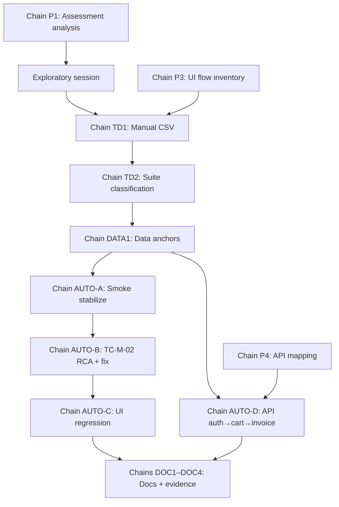

# AI Prompt History — Index

**Tool:** Cursor (Agent)  
**Repo:** https://github.com/shagunadya/qa-ai-practical-assessment  
**Assessment period:** 2026-08-10 — 2026-08-11

This folder captures **prompt → AI response → outcome → QA decision** logs with **iteration chains** (each chain refines or branches from the prior outcome).

---

## Log files

| File | Phase | Chains |
|------|-------|--------|
| [`requirements-and-planning.md`](requirements-and-planning.md) | Assessment analysis, repo bootstrap, flow inventory | **Chain P1** (plan gate) · **Chain P2** (bootstrap) · **Chain P3** (UI flows) · **Chain P4** (API mapping) |
| [`test-design.md`](test-design.md) | Manual suite + automation mapping | **Chain TD1** (exploration → CSV) · **Chain TD2** (smoke/regression cap) · **Chain TD3** (manual → spec map) |
| [`test-data.md`](test-data.md) | UI/API test data | **Chain DATA1** (anchors) · **Chain DATA2** (dynamic users) · **Chain DATA3** (API password) · **Chain DATA4** (invoice billing) · **Chain DATA5** (lockout / env) |
| [`automation-and-debugging.md`](automation-and-debugging.md) | Playwright implementation & fixes | **Chain AUTO-A** (smoke) · **Chain AUTO-B** (TC-M-02) · **Chain AUTO-C** (UI regression) · **Chain AUTO-D** (API) |
| [`documentation-and-summary.md`](documentation-and-summary.md) | README, project-info, evidence | **Chain DOC1** (project-info) · **Chain DOC2** (README) · **Chain DOC3** (planning) · **Chain DOC4** (evidence) |

---

## Master iteration map (cross-phase)

---

## Iteration log format

Each iteration block uses:

| Field | Meaning |
|-------|---------|
| **Prompt** | What was asked (verbatim or paraphrased from session) |
| **AI response** | Summary of model output |
| **Outcome** | Run result, artefact produced, or gate status |
| **QA decision** | Human accept / reject / refine → next iteration |
| **Artefacts** | Files created or updated |

---

## Honesty notes

- Chains **P3/P4** in planning were drafted as prompts before exploration; outcomes were recorded after `exploratory-notes.md` and implementation (not live chat transcripts for every word).
- **Chain AUTO-A** session outcome (5/5 smoke) is from 2026-08-10; later runs (2026-08-11) hit demo account lockout — see `evidence/reports/RUN-MANIFEST.md`.
- Templates marked **partial** in the submission checklist (e.g. `.cursor/rules/`, green full-suite run) reflect items still open — see [`documentation-and-summary.md`](documentation-and-summary.md).
