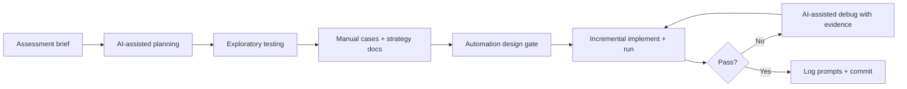

# Project Info — QA AI Capability Exercise

**Assessment start:** 2026-08-10  
**Submission date:** _(fill on submit)_  
**Repository:** https://github.com/shagunadya/qa-ai-practical-assessment

---

## 1. Project Summary

This repository documents an AI-assisted QA capability assessment against **Practice Software Testing Toolshop v5.0** — a public ecommerce practice application (UI + REST API).

**In scope (confirmed in `docs/test-strategy.md` and delivered in code):**

| Flow | Coverage |
|------|----------|
| **UI AC1** | Register → login → profile verification |
| **UI AC2** | Multi-product cart → quantity update → Cash on Delivery checkout → **double Confirm** → My Invoices |
| **API AC1** | Register/login → Bearer token → create cart |
| **API AC2** | Products → cart → invoice (`cash-on-delivery`) |

**Deliverables present in the repo:**

- Manual suite: `FunctionalTestCase.csv` (**11 cases**, TC-M-01 … TC-M-11)
- UI automation: **12** Playwright specs under `PrismStructure/tests/ui/`
- API automation: **9** Playwright specs under `PrismStructure/tests/api/`
- Strategy docs: `docs/test-strategy.md`, `docs/requirements-and-planning.md`, `docs/test-data-strategy.md`, `docs/limitations-and-gaps.md`
- Execution evidence: `evidence/reports/` (see `RUN-MANIFEST.md`)

**Out of scope:** Admin operations, non-COD payment paths, performance/load testing, cross-browser beyond Chromium, full OpenAPI surface (`docs/test-strategy.md` §2).

**QA decision (human):** Scope, risk priorities (R-01 double Confirm, R-07 account lockout), and scenario shortlists were set before automation. AI accelerated drafting and implementation; execution results and exploration notes were the acceptance gate.

---

## 2. Tools Used

| Category | Tool | Evidence |
|----------|------|----------|
| Primary AI | **Cursor** (Agent-assisted sessions) | `ai-prompts/`, session log in `automation-and-debugging.md` |
| AI model / mode | Not recorded in prompt logs | _(Cursor Agent used; specific model name not documented)_ |
| Test framework | **Playwright Test** `^1.49.0` | `package.json`, `playwright.config.js` |
| Language | JavaScript (Node.js) | All specs and POMs |
| Project structure | **Prism Framework** (`PrismStructure/`) | Pages, API client, fixtures, data modules |
| Config / env | `dotenv` + `.env.example` | `playwright.config.js`, `.env.example` |
| Browser (UI) | Chromium (Desktop Chrome profile) | `playwright.config.js` `chromium` project |
| Version control | Git / GitHub (`master`) | Iterative commits from 2026-08-10 onward |
| API reference | OpenAPI 5.0.0 (public Swagger) | Referenced in strategy docs and debugging log |
| CI | None configured | No workflow files in repo |

**Not used:** Secret-scanning tools, external test management systems, or third-party API example repos (fetch was skipped per debugging log).

---

## 3. Setup Summary

**Prerequisites:** Node.js and npm (local environment reported as Node v24.15.0 / npm 11.12.1 in `ai-prompts/requirements-and-planning.md`).

**Install and run:**

```bash
npm install
cp .env.example .env   # optional — defaults point to public Toolshop URLs
npx playwright test --grep "@smoke" --workers=1
npx playwright test --project=api --workers=1
npm run report         # opens PrismStructure/reports/html
```

**Configuration highlights (`playwright.config.js`):**

- `testDir`: `./PrismStructure/tests`
- UI `baseURL`: `https://practicesoftwaretesting.com` (override via `UI_BASE_URL`)
- API project: `testMatch **/api/**/*.api.spec.js`, `baseURL` `https://api.practicesoftwaretesting.com`, **`workers: 1`** (reduce shared-user lockout)
- Selectors: `testIdAttribute: 'data-test'`
- Reports: list + HTML to `PrismStructure/reports/html`

**npm scripts:** `test`, `test:smoke`, `test:regression`, `test:ui`, `test:api`, `report` (`package.json`).

**Note:** No root `README.md` exists yet; setup is documented here and in `docs/test-strategy.md` §14.

---

## 4. How project/SUT context was provided to AI

Context was supplied iteratively through Cursor chat, referencing repo files and public SUT URLs — not a single upfront brief.

| Context type | What was shared | Where recorded |
|--------------|-----------------|----------------|
| Assessment brief | Playwright + Prism, UI/API/manual deliverables, 5–8 test cap, documentation requirements | `ai-prompts/requirements-and-planning.md` Prompt 01 |
| Live SUT | `https://practicesoftwaretesting.com`, `https://api.practicesoftwaretesting.com` | Config, exploration notes, prompts |
| Repo artefacts | `PrismStructure/` code, `FunctionalTestCase.csv`, strategy docs, exploratory notes | Opened/edited in Cursor during sessions |
| Failure artefacts | Playwright errors, `error-context.md`, screenshots, spec/POM excerpts | `ai-prompts/automation-and-debugging.md` |
| Execution feedback | Pass/fail from `npx playwright test` (smoke, regression, `--project=api`, `--workers=1`) | Debugging log |
| Constraints | “Do not modify code yet”, “implement one scenario at a time”, “do not invent API fields” | Debugging log interactions 2, 6, 7 |

**QA decision:** I chose what to paste (failure output, ranked hypotheses) and when to gate implementation. Public demo credentials (`customer@practicesoftwaretesting.com` / `welcome01`) were referenced as documented SUT fixtures, not private secrets.

---

## 5. Requirement analysis with AI

**Performed:** Prompt 01 — Assessment Analysis (`ai-prompts/requirements-and-planning.md`).

**AI assistance:** Produced objectives, SUT scope, 12 deliverables, UI/API/manual/automation boundaries, constraints, risks (double Confirm, demo lockout, API parallelism), and a list of items requiring exploration before coding.

**QA validation (human):**

- Confirmed deliverables against the assessment brief
- Verified public UI/API URLs and Toolshop v5.0 scope
- Recorded interpretation of the **5–8 test cap** (combined smoke + regression per layer)
- **Deferred all code** until exploratory testing closed open questions (Confirm UX, COD steps, demo users)

**Partially planned (not fully executed in prompt log):** UI flow inventory (Entry 3) and OpenAPI lifecycle mapping (Entry 4) — marked pending; equivalent content was captured manually in `exploratory-testing/exploratory-notes.md` and `docs/test-strategy.md` instead.

---

## 6. Test planning and strategy with AI

**Primary artefacts (human-authored, AI-informed):**

- `docs/test-strategy.md` — scope, levels, smoke/regression split, positive/negative/edge mix, execution and evidence strategy
- `docs/test-data-strategy.md` — data sets per manual TC, static vs dynamic values, reuse matrix
- Planning decisions table in `ai-prompts/requirements-and-planning.md` (COD-only, `data-test` selectors, Bearer JWT, API `workers: 1`)

**AI role:** Early planning prompt shaped structure and risk framing; detailed strategy documents were written/reviewed as QA artefacts aligned with exploration findings.

**QA decisions (human):**

- Four confirmed flows (UI AC1/AC2, API AC1/AC2) as automation backbone
- Risk-based priorities: R-01 (double Confirm), R-02 (COD), R-04/R-08 (cart), R-07 (lockout), R-13/R-14 (invoice visibility / UI↔API parity)
- Phased execution: explore → manual CSV → UI smoke → API smoke → regression → green run

---

## 7. Manual test design with AI

**Delivered:** `FunctionalTestCase.csv` — **11 manual cases**:

| Suite | Count | IDs |
|-------|-------|-----|
| Smoke | 2 | TC-M-01 (register/login/profile), TC-M-02 (COD multi-product checkout) |
| Regression | 9 | TC-M-03 … TC-M-11 (negatives/edge + registration, logout, invoice details) |

Each row includes scenario type (Positive / Negative / Edge), priority, and risk traceability (R-01–R-14).

**AI assistance:** `ai-prompts/test-design.md` remains a **template** (Prompt 02 not filled). Manual design was driven by exploratory session (`exploratory-testing/exploratory-notes.md`) and strategy docs; AI contributed indirectly via planning prompts and later automation mapping.

**QA decision (human):** Case wording, preconditions, and expected results were locked from live UI/API behaviour (e.g. double Confirm, product anchors **Combination Pliers** / **Pliers**, COD label).

**Defects:** `defects/defect-report.md` is a template with **0 logged defects**; double Confirm is documented as intentional SUT behaviour (R-01), not a defect.

---

## 8. Automation design with AI

**UI automation** (`PrismStructure/tests/ui/`):

| Suite | Count | Specs | Manual trace |
|-------|-------|-------|--------------|
| Smoke | 3 | `foundation.smoke.spec.js`, `auth.smoke.spec.js`, `checkout.smoke.spec.js` | TC-M-01, TC-M-02 (+ foundation connectivity check) |
| Regression | 9 | `invalid-login`, `duplicate-registration`, `empty-cart`, `single-confirm`, `ui-api-invoice`, `cod-payment`, `registration`, `logout`, `invoice-details` | TC-M-03 … TC-M-11 |
| **Total** | **12** | | |

**API automation** (`PrismStructure/tests/api/`):

| Suite | Count | Specs |
|-------|-------|-------|
| Smoke | 4 | `auth.smoke`, `auth-lifecycle.smoke`, `cart.smoke`, `products.smoke` |
| Regression | 5 | `register`, `duplicate-register`, `invalid-login`, `cart`, `invoice` |
| **Total** | **9** | |

**Design pattern (human-approved, AI-implemented):**

- POM: `PrismStructure/pages/` (Login, Register, Products, Cart, Checkout, Invoices, Profile)
- API: `ToolshopApiClient.js`, `api-assertions.js`, `api-fixtures.js`
- Tags: `@smoke` / `@regression` for selective runs

**AI assistance:** Interaction 6 in `automation-and-debugging.md` — API structure designed **without code** first (client, assertions, fixtures, folder layout). UI/API specs were generated incrementally per approved scenario.

**QA decision (human):** Approved phased delivery (auth → cart → invoice API; one UI regression at a time). Counts are **12 UI + 9 API** (above the 5–8 guideline per layer) due to `foundation.smoke.spec.js`, extended regression (TC-M-09–11), and API smoke split; core AC scenarios remain within cap intent.

---

## 9. AI-generated test validation

Generated automation was **not** accepted without execution evidence.

| Validation step | What I did |
|-----------------|------------|
| Run tests locally | `npx playwright test`, `--grep "@smoke"`, `@regression`, `--project=api`, `--workers=1` |
| Inspect failures | HTML report, screenshots, Playwright `error-context.md` |
| Cross-check exploration | Selectors, checkout steps, product anchors vs `exploratory-notes.md` |
| Network evidence | TC-M-02: confirmed `POST /carts` vs `POST /carts/{id}` before fixing cart waiter |
| Live API probes | Invoice billing `422` messages drove profile-based billing mapping |
| Traceability | Each UI regression `describe` block names TC-M-0x; API tests map to strategy flows |
| Field discipline | Invoice assertions limited to fields confirmed in live responses |

**Session outcome (documented):** UI smoke **5/5 passing** with `--workers=1` after cart waiter fix (`ai-prompts/automation-and-debugging.md`). API cart and invoice regression verified passing in session; full-suite green run should be repeated before submission.

**Manual cases:** Authored/reviewed separately in CSV; AI assisted mapping to specs, not replacement of exploratory findings.

---

## 10. Test data generation

**Modules:**

- `PrismStructure/data/ui-test-data.js` — seeded demo user, billing address, dynamic registration email/password
- `PrismStructure/data/api-test-data.js` — `buildRegistrationBody()`, `buildInvoicePayload()`, `mapProfileAddressToBilling()`

| Data | Strategy | QA vs AI |
|------|----------|----------|
| Registration email | Dynamic suffix (`john.doe.{timestamp}@example.com`) | QA rule; AI implemented in data module |
| API password | Dynamic `Qa!Test{suffix}#9` after `SuperSecure@123` breached-password `422` | **Human** caught via test run; AI applied fix |
| Seeded UI user | `customer@practicesoftwaretesting.com` / `welcome01` | Public SUT fixture from exploration |
| Products | **Combination Pliers**, **Pliers** (UI names); API resolves `product_id` at runtime | Locked in exploration; API IDs dynamic |
| Invoice billing | Profile address from `GET /users/me` mapped to billing payload | **Human** decision after geo-validation failures |
| Tokens / cart IDs | Runtime only — never committed | Enforced in client + fixtures |

**`ai-prompts/test-data.md`:** Checklist template only; substantive strategy is in `docs/test-data-strategy.md`.

**Env:** `.env.example` documents optional overrides; `.env` is gitignored.

---

## 11. Debugging with AI

Full log: **`ai-prompts/automation-and-debugging.md`** (10 documented interactions).

| Issue | AI role | QA / execution resolution |
|-------|---------|---------------------------|
| PowerShell `@smoke` parsing | Diagnosed quoting | Quote as `"@smoke"` |
| Module not found | Fixed import depth | `../../../` paths in nested specs |
| TC-M-02 cart count (1 not 2) | Ranked root causes **before code** | Wait on `POST /carts/{cartId}` only |
| Checkout billing/payment UI drift | Suggested POM updates | Sign-in proceed, country `<select>`, house number, COD dropdown |
| API register `422` breached password | Identified from error body | Dynamic password in `buildRegistrationBody()` |
| Invoice billing `422` | Probed validation messages | `mapProfileAddressToBilling()` from user profile |
| `POST /invoices` status | OpenAPI said 200 | Assert **201** from live response |
| Empty cart message | Assumed copy from notes | Relaxed to blocked checkout / no payment step |
| TC-M-08 COD detection | Locator suggestions | Read Payment Method dropdown state |

**Principle applied:** When AI output conflicted with runs or screenshots, **execution evidence won**.

---

## 12. Responsible AI usage

- **Narrow, verifiable prompts** worked best: run smoke, rank failure causes, implement one scenario, extend an existing pattern.
- **Plan and explore before automate** — explicit “do not implement yet” gates prevented wasted code (TC-M-02 diagnosis, API structure design).
- **Incremental delivery** — one approved UI regression and one API phase at a time; rejected broad refactors.
- **Auditable trail** — prompts and outcomes in `ai-prompts/` for assessor review.
- **No blind trust** — OpenAPI, strategy docs, and exploratory notes were treated as hypotheses until Playwright runs confirmed behaviour.
- **Git discipline** — iterative commits per phase; manual verification when IDE git operations timed out.
- **Limits acknowledged** — AI accelerated boilerplate (POM, fixtures, assertions) but did not replace exploratory testing, manual judgment, or test execution.

---

## 13. Information avoided when using AI

| Not shared | Reason |
|------------|--------|
| `.env` contents or local credential overrides | Gitignored; documented only via `.env.example` |
| Hardcoded bearer tokens or session cookies | Obtained at runtime via login |
| Real personal data | Synthetic names/emails only |
| Production or employer systems | Scope limited to public Toolshop |
| Unrelated / proprietary repositories | Stayed within this assessment repo |
| External GitHub invoice examples | Fetch skipped; relied on live API behaviour |

Public demo credentials referenced in data modules are **documented SUT fixtures**, not private secrets. No additional secret-scanning tooling was added; control was procedural (review before commit, no `.env` in git).

---

## 14. Reusable QA workflow

Workflow used for this assessment (repeatable for similar AI-assisted QA exercises):



**Steps:**

1. **Analyze requirements with AI** — deliverables, caps, risks; defer code until exploration items are listed.
2. **Explore the SUT manually** — record selectors, flows, API mapping (`exploratory-notes.md`).
3. **Author manual suite** — trace to risks and ACs (`FunctionalTestCase.csv`).
4. **Write strategy docs** — test levels, data, execution commands.
5. **Design automation structure** — approve layout before implementation (especially API).
6. **Implement one scenario at a time** — run after each addition; use `--workers=1` on shared demo environments.
7. **Debug with evidence** — paste failures; request root-cause analysis before fixes when appropriate.
8. **Validate generated code** — runs, reports, network tab, live API status codes.
9. **Document AI interactions** — prompt, validation, what was wrong, final outcome.
10. **Commit iteratively** — small reviewable diffs per phase.

**Commands to keep:** `npx playwright test --grep "@smoke" --workers=1`, `npx playwright test --project=api --workers=1`, `npm run report`.

---

## 15. Key learnings

**What worked**

- AI was fastest on scaffolding (POM methods, `api-assertions.js`, fixture wiring), freeing time for SUT behaviour.
- “Diagnose before fix” for TC-M-02 produced a one-line network waiter change instead of speculative rewrites.
- Asserting only **confirmed** API response fields avoided false positives (e.g. `payment_method` absent on invoice create).
- Logging sessions in `automation-and-debugging.md` supports reflection and assessor review.

**What needed correction**

- Written docs and OpenAPI often diverged from live Toolshop (checkout steps, password policy, invoice `201`, billing geo-validation, empty-cart UX).
- Exploratory notes can stale quickly; screenshots and runs must override notes.
- Parallel workers against a shared demo site increased flakiness — `--workers=1` should be default earlier.

**Gaps in this submission (see [`docs/limitations-and-gaps.md`](docs/limitations-and-gaps.md))**

- Full 21-test suite green on shared SUT remains **open**; smoke **7/7** and regression **10/11** evidenced in `evidence/reports/`.
- Cursor rules/skills added under `.cursor/`; execution demo in `evidence/EXECUTION-DEMO.md`.
- No CI pipeline; Chromium-only configuration.

**Overall**

AI helped deliver a structured Playwright suite within assessment scope, but **did not replace** exploration, manual test design, or execution-based validation. Responsible use meant sharing only repo and public SUT context, rejecting suggestions that conflicted with observed behaviour, and keeping human gates on scope and implementation order.

---

## Quick reference — coverage counts

| Layer | Smoke | Regression | Total |
|-------|-------|------------|-------|
| Manual (`FunctionalTestCase.csv`) | 2 | 9 | **11** |
| UI automation | 3 | 9 | **12** |
| API automation | 4 | 5 | **9** |
| **Automated total** | 7 `@smoke` | 14 `@regression` | **21** |

**SUT:** UI https://practicesoftwaretesting.com · API https://api.practicesoftwaretesting.com · Docs https://api.practicesoftwaretesting.com/api/documentation
